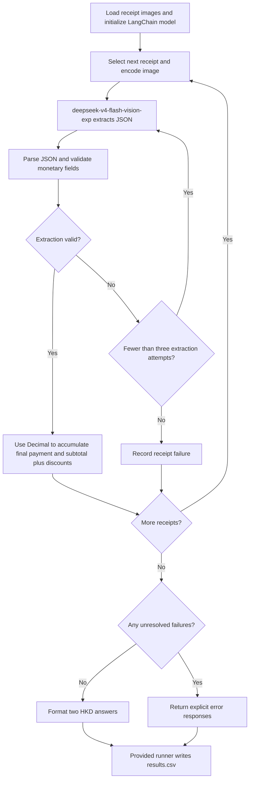

# FTEC5660 Homework 1: Receipt Chain

Build a LangChain pipeline that reads every supermarket receipt in a folder
with the vision-capable DeepSeek Flash model and answers these two questions:

1. How much money did I spend in total for these bills?
2. How much would I have had to pay without the discount?

For this homework, **amount spent** means the final payment after the receipt's
rounding line. **Without the discount** means the sum of the original positive
item prices: add back every promotion, coupon, member, app, packaging-damage,
and percentage discount, but do not add back rounding.

## Student task

Only edit the two functions in `hw1.py` that contain `### YOUR CODE HERE`:

- `build_chain()` creates your LangChain chain.
- `answer_queries()` runs the chain on the receipt images and returns one final
  response for each question.

You may use prompt chaining, routing, parallel calls, reflection, or a
combination. Your final responses should each contain one HKD amount. Do not
hard-code filenames or public answers; grading uses unseen receipt folders.

## Setup and public test

```bash
python3 -m venv .venv
source .venv/bin/activate
pip install -r requirements.txt
```

Put your DeepSeek key after `DEEPSEEK_API_KEY=` in `.env`, then run:

```bash
python3 hw1.py --image-folder public_test
```

The program creates `results.csv` in the current directory. Its columns are
`query`, `model_response`, and `correctness`. The public answers are in
`public_test/ground_truth.json`. The starter intentionally returns the dummy
response `please design your chain to answer these two queries.` so it runs
before you add any API code.

The required model is `deepseek-v4-flash-vision-exp`, the vision-capable
DeepSeek Flash model. JPEG, PNG, GIF, and WebP inputs are accepted by the
homework runner.


## Homework 1 solution: 


My solution uses a sequential extraction–validation–aggregation pipeline implemented with LangChain and `deepseek-v4-flash-vision-exp`. The model and prompts are initialized once in `build_chain()`. For each receipt, `answer_queries()` sends the image to the model and requests JSON containing the printed subtotal, all discount amounts, and the final payment after rounding. The prompt includes promotions, coupons, member offers, and Chinese-labelled packaging-damage markdowns, while excluding rounding from discounts. Python parses the response, checks the required fields and monetary values, and uses `Decimal` for arithmetic. Query 1 sums the final payments; Query 2 sums each subtotal plus the absolute values of its discounts, without adding back rounding. Empty, malformed, or invalid responses trigger another extraction, with up to three extraction attempts per receipt. If any receipt remains unresolved, the program returns explicit error responses instead of incomplete totals. Otherwise, it returns one HKD amount per query for the provided runner to write to `results.csv`. The final public-test run returned HK$1974.30 and HK$2348.20, both marked correct; performance on unseen receipts still depends on extraction accuracy.

